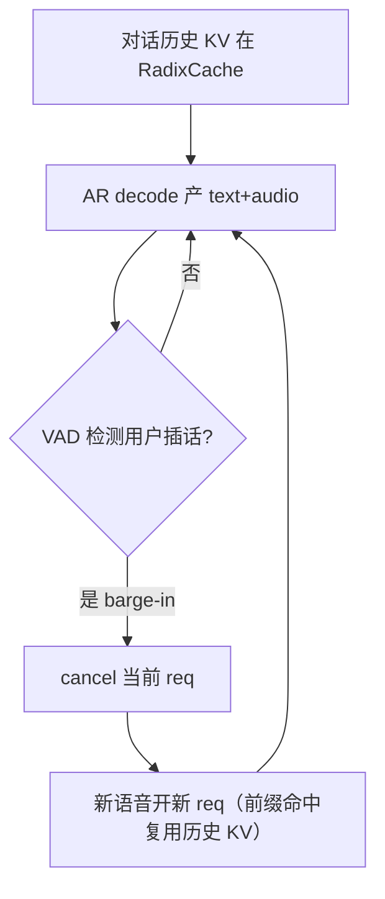
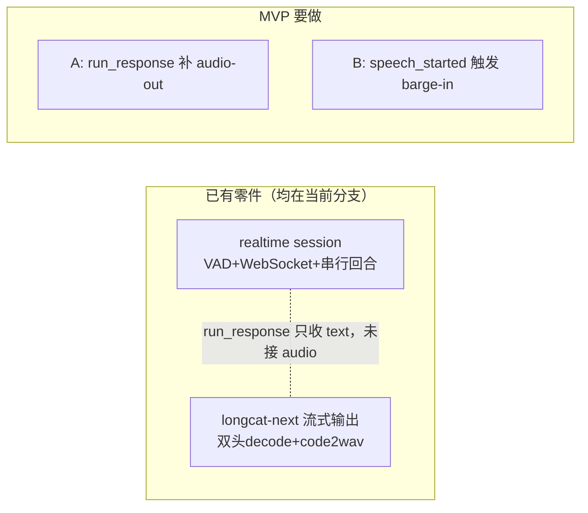

# LongCat-Next Phase 4 设计文档

> **范围**：本文档规划 Phase 4 的三条演进方向 —— (1) 多模态输入缓存 CPU offload、(2) 流式输出性能优化、(3) 全双工对话架构。
>
> **前置**：Phase 1（AR backbone）、Phase 2（多模态输入理解）、Phase 2.5（性能优化）、Phase 3（端到端语音输出）已完成。参见 `README.md` 与 `longcat_next_debug.md`。

---

## 目录

- [1. 多模态输入缓存 CPU Offload](#1-多模态输入缓存-cpu-offload)
- [2. 流式输出性能优化](#2-流式输出性能优化)
- [3. 全双工对话架构](#3-全双工对话架构)
- [4. MVP 工程 Demo 落地方案](#4-mvp-工程-demo-落地方案)
- [5. 落地优先级](#5-落地优先级)

---

## 1. 多模态输入缓存 CPU Offload

### 1.1 现状

图像 / 音频 encoder 的输出缓存目前**常驻 encoder GPU 显存**。

```python
# stages.py — create_image_encoder_executor / create_audio_encoder_executor
cache = StageOutputCache(
    max_size=_ENCODER_CACHE_MAX_SIZE,     # 256 条
    max_bytes=_ENCODER_CACHE_MAX_BYTES,   # 1 GiB
    cache_device=None,                    # ← None = 张量保留在原设备(GPU)
)
```

`StageOutputCache._detach_value` 在 `cache_device=None` 时不做设备迁移，因此缓存的 `visual_embeds` / `audio_embeds`（AR hidden-size 大张量）直接占用 GPU0 / GPU1 的显存，与 ViT / audio tokenizer 的 batch 空间争抢。

**关键数据流（决定 offload 设计）**：encoder 输出并不在 encoder 进程内直接喂给 AR，而是走一条跨进程 relay：

```
encoder forward → result dict{visual_embeds/audio_embeds}
  → _finalize_pending: state.encoder_outs[stage] = result + cache.put(key, result)
  → merge.merge_for_text_ar: longcat_mm_inputs["image_embeds"] = visual_embeds
  → TensorRef SHM relay (config.py: SGLANG_OMNI_TENSOR_REF_PATHS=visual_embeds,audio_embeds)
  → AR 进程 model_runner.py:103: chunk.to(device=device)   ← 真正的 H2D 发生在这里
```

这条数据流有两个直接推论：

1. **命中路径本来就要经过一次 H2D**（在 AR 侧 `model_runner.py:103`），而非 encoder 侧。所以把 cache 放 CPU **不会新增一次 H2D**，只是把"命中后从哪儿取"从 encoder GPU 换成 encoder 进程的 CPU pinned buffer —— 随后照旧走 TensorRef relay 到 AR。**offload 命中开销远低于"多一次完整 H2D"的直觉估计。**
2. **cache 的最终消费者是 AR 进程，不是 encoder 进程**。因此 encoder 侧根本不需要把命中的张量再 upload 回 encoder GPU；它只需把 CPU 张量交给 relay 即可。所谓"命中时 re-upload"实际发生在 AR 侧、且**已经存在**。

### 1.2 目标

将 encoder 输出缓存 offload 到 CPU（pinned memory），释放 encoder GPU 显存，命中时异步搬回 GPU。

### 1.3 可行性

`StageOutputCache` **已原生支持** offload —— `put()` 时 `_detach_value(data, device=self.cache_device)` 会把张量搬到指定设备（`stage_cache.py:82`）。只需将 `cache_device` 从 `None` 改为 `"cpu"`，改动量极小。

### 1.4 Trade-off

| 方案 | GPU 显存 | 命中延迟 | 适用场景 |
|---|---|---|---|
| GPU cache（现状） | 占 encoder GPU 1 GiB | 零拷贝，命中即用 | 显存宽裕、追求极致延迟 |
| CPU offload | 释放 GPU 显存 | 命中时 encoder GPU 显存零占用；H2D 已在 AR 侧存在（§1.1），几乎无新增 | 显存吃紧（68B MoE + KV cache 争抢） |

**判断**：在 LongCat-Next 场景下 offload 偏合理：
1. Encoder GPU 上也要跑 ViT / audio tokenizer，1 GiB cache 挤占的是 encoder 自己的 batch 空间。
2. 命中的是输入侧（图片/音频文件），命中后本来就要走 relay 到 text_ar，H2D 在 AR 侧已存在（§1.1），offload 几乎不新增拷贝。
3. Cache 张量最终归宿本就要经过 CPU relay（TensorRef/SHM），放 CPU 与下游数据流更顺。

### 1.5 缓存索引 / Evict / 迁移 / 命中回传设计

#### 1.5.1 索引：encoder 级别的 key 语义（保持不变）

cache key 由 preprocessor 生成，是 `path + size + mtime_ns` 指纹（`preprocessor.py:176 _build_media_cache_key`），多文件拼接：

```
"{path}:{st_size}:{st_mtime_ns}"  逐文件拼接 → 整批一个 key
```

- **与设备无关**：key 只描述"输入内容"，offload 到 CPU 不改变命中判定，正确性无损。
- **encoder 级隔离**：image / audio 各自持有独立 `StageOutputCache` 实例（`stages.py:257 / 414`），key 空间天然按 stage 隔离，无需额外前缀。
- 索引结构仍是 `OrderedDict[key → _CacheEntry]`（LRU 序），offload 只改 entry 里张量的**驻留设备**，不改索引层。

#### 1.5.2 Evict：字节预算按"设备侧"计量

现状 `_evict_over_budget` 按 `max_size`(256) 和 `max_bytes`(1 GiB) 双约束 LRU 淘汰（`stage_cache.py:106`）。offload 后：

- **`max_bytes` 语义从"GPU 显存预算"变为"CPU pinned 内存预算"**。pinned memory 是稀缺的锁页内存（不可换页），预算应独立配置，建议 offload 模式下调大（如 4 GiB），因为 CPU 内存比 encoder GPU 显存宽裕。
- `_value_size_bytes` 计量与设备无关（只看 `numel * element_size`），evict 逻辑无需改动。
- **淘汰即释放 pinned buffer**：evict 时应显式归还 pinned 内存到 pool（见 1.5.4），否则锁页内存泄漏比普通 GPU cache 更危险。

#### 1.5.3 迁移（put，GPU→CPU offload）

`put()` 时 `_detach_value(data, device="cpu")` 完成 D2H。要点：

1. **落到 pinned memory**：普通 pageable CPU 张量的 H2D/D2H 无法与 compute overlap（driver 需先暂存到内部 pinned buffer，隐式同步）。必须 `.pin_memory()` 或预分配 pinned pool，才能让后续 relay 的 H2D 走异步 DMA。依据见 §1.6[1][3]。
2. **D2H 异步化 + 不阻塞 encoder 主流**：offload 拷贝放独立 CUDA stream，用 event 让 encoder 下一个 batch 的 compute 不必等 D2H 完成。encoder 已经算出 result 并 `detach`，offload 是纯搬运，适合后台 stream。
3. **写时机**：`put` 发生在 `_finalize_pending`，此时 result 已 detach，可安全在 side stream 上发起 D2H。

#### 1.5.4 命中回传（get，CPU→relay，可 overlap）

**先厘清 `model_runner.py:103` 的 `chunk.to(device)` 到底解决什么问题** —— 它有双重用途：

1. **relay 落地设备 ≠ AR 计算设备**：relay 收到的张量落在 `relay.device`（`relay_io.py:592/599`）。shm / mooncake relay 落 **CPU**，NCCL relay 可落 **GPU**。当前多模态 TensorRef 走 shm relay（落 CPU），故 `:103` 这次 `.to(device)` 就是那唯一的一次 H2D。
2. **chunked-prefill 惰性切片（关键，也是它"晚"的原因）**：`:95` 的 `chunk = embeds[offset : offset+selected_count]` 只取**当前 prefill chunk 覆盖的 token**，`:103` 只 upload 这一片，`_longcat_mm_consumed` 跨 chunk 记录消费偏移。长多模态序列被切成多步，每步只搬当前 chunk 的切片——**这是惰性上传**：省 AR GPU 显存 + 省无用带宽（还没轮到的 chunk 不上传），并非疏忽。

**能否在 encoder 侧就 upload 到 AR GPU 来 overlap？** 能（relay 换 NCCL/mooncake GPU→GPU backend 即可，`relay.device` 变 AR GPU、`:103` 退化为 no-op），但与本章两个目标冲突：

| 方案 | overlap | encoder GPU 显存 | AR GPU 显存 | 破坏 chunked 惰性 |
|---|---|---|---|---|
| 现状 `:103` 同步搬 | ❌ | 省（若 cache offload） | 省 | 否 |
| encoder 侧 GPU→GPU 提前推整块 | ✅ | **不省**（起点仍是 encoder GPU） | 涨（整块常驻） | 是 |
| **AR 侧 pinned + prefetch 下一片**（推荐） | ✅ | 省 | 省 | 否 |

- encoder 侧提前推**同时破坏**"省 encoder GPU 显存"（本章 offload 初衷）和 chunked 惰性（整块常驻 AR GPU），不是纯赚。
- **推荐方案**：把 `:103` 从"用时才同步搬"升级为"**prefetch 下一个 chunk 的切片**"——cache 命中拿到 **CPU pinned** 张量（§1.5.3 保证），AR 侧在当前 chunk forward 的同时，用 side stream `non_blocking=True` 异步预取下一 chunk 的切片 H2D。既保留 chunked 惰性（不整块占显存、不占 encoder GPU），又把 H2D 藏在 compute 后面，overlap 收益接近"encoder 提前推"。
- **MVP 最小实现**：先把 `:103` 的 `.to(device)` 加 `non_blocking=True`（源为 pinned 时即可与 prefill 前置算子 overlap）；prefetch 下一 chunk 作为后续增强。

#### 1.5.5 Pinned memory pool（避免反复 pin/unpin）

`.pin_memory()` 每次都 `cudaHostAlloc`/`cudaHostRegister`，开销高且易碎片。参考 vLLM / DeepSpeed 做法（§1.6[2][4]）用**固定大小的 pinned buffer pool + 双缓冲**：

- 预分配 N 块定长 pinned buffer，put 时从 pool 借、evict 时还，避免运行时反复 pin。
- 双缓冲（double buffering）：一块正在被 relay 读，另一块接收下一次 offload 的 D2H，两者 overlap。

### 1.6 开源实现依据

1. **NVIDIA CUDA 最佳实践 —— pinned memory 是异步拷贝的前提**：pageable memory 的 `cudaMemcpyAsync` 会退化为同步（driver 需先 copy 到内部 pinned staging）；只有 page-locked (pinned) memory 才能与 kernel 执行真正并发。这是 1.5.3[1] 必须 pin 的根本依据。（*CUDA C++ Best Practices Guide — Asynchronous Transfers and Overlapping / Pinned Memory*）
2. **vLLM CPU KV offloading** —— 用独立 offloading buffer（GiB 级预算）+ read/write 分离计量 + sync/async tiering，印证 1.5.2 的"独立字节预算"与 1.5.3 的"异步 tiering"设计。（*vLLM Engine Args: kv offloading buffer；vLLM release notes: split CPU cache read/write gauges, tiering sync/async histograms*）
3. **PyTorch pinned-memory + `non_blocking=True` H2D overlap** —— 官方教程明确：源张量在 pinned memory 时，`.to(device, non_blocking=True)` 可与后续 GPU 计算 overlap，是 1.5.4 AR 侧 overlap 的标准手法。（*PyTorch tutorials: "A guide on good usage of non_blocking and pin_memory"*）
4. **DeepSpeed ZeRO-Offload / Infinity 的 pinned buffer pool + prefetch double-buffer** —— 预分配定长 pinned buffer、借还复用、prefetch 与 compute overlap，是 1.5.5 pool 化双缓冲的成熟范式。（*DeepSpeed ZeRO-Infinity: 用 pinned memory pool 做 param/activation offload 的 overlap prefetch*）

> 共识：offload 本身不难，难在**让 D2H/H2D 与 compute overlap**，而 overlap 的**硬前提是 pinned memory**；生产级实现（vLLM/DeepSpeed）都用**固定 pinned pool + 双缓冲/prefetch** 摊薄 pin 成本并隐藏传输延迟。

### 1.7 验证方法

`SGLANG_OMNI_LONGCAT_DEBUG_TIMING=1` 下，对比 offload 前后：
- `encoder_cache action=hit` → AR 侧 `chunk.to(device)` 的 H2D 耗时（确认 pinned + non_blocking 是否 overlap 生效）
- encoder GPU 的 `nvidia-smi` 显存占用下降幅度（预期释放约 1 GiB）
- CPU pinned 内存占用是否在预算内、evict 是否正常归还 buffer
- 端到端 P50/P99 首字延迟是否回退（overlap 达标应无明显回退）

### 1.8 实现要点与涉及文件

**环境变量门控**，默认关闭以保持向后兼容：
```
SGLANG_OMNI_LONGCAT_ENCODER_CACHE_DEVICE=cpu     # 默认 gpu/None
SGLANG_OMNI_LONGCAT_ENCODER_CACHE_MAX_BYTES=...  # offload 模式独立预算(建议调大)
```

| 文件 | 改动 |
|---|---|
| `scheduling/stage_cache.py` | `put` 走 pinned pool + side-stream D2H；evict 归还 pinned buffer；pinned buffer pool + 双缓冲 |
| `models/longcat_next/stages.py` | 两处 `cache_device` 由环境变量解析；`max_bytes` 支持 offload 独立预算 |
| `models/longcat_next/model_runner.py` | `:103` 的 `chunk.to(device)` 改 `non_blocking=True` 并与前置算子 overlap（命中回传的真正 overlap 点） |

---

## 2. 流式输出性能优化

### 2.1 当前流式路径

```
text_ar decode(每步 8 codes)
  → _audio_stream_builder 每步发 OutgoingMessage(stream)
  → relay 跨进程 GPU5 → GPU6
  → _StreamingCode2WavScheduler._buffers 攒帧(每 20 帧)
  → flow matching de-tokenizer → HiFi-GAN vocoder
  → PCM bytes(24kHz)
```

### 2.2 已识别瓶颈与优化

#### P1. Vocoder D2H 阻塞（收益最大，有现成参考）⏸ 暂缓（需 GPU 验证）

**问题**：`code2wav.py:166` 的 `wav.cpu()` 是阻塞 D2H，卡住下一个 buffer 的 vocoder launch。（涉及 CUDA stream/event 双缓冲的正确性，无 GPU 环境无法验证，暂缓。）

**优化**：借鉴 `origin/main` commit `b79b1e0`（"Overlap Code2Wav output materialization with vocoder launches"）—— 把 PCM 的 D2H materialization 与下一次 vocoder launch overlap，用独立 CUDA stream + event 同步。

#### P2. 逐帧跨进程 relay 开销 ❌ 不做（收益边际、代码核对后证伪）

**原描述**：`_audio_stream_builder` 每 decode step 发一个 `OutgoingMessage`，"逐帧 D2H + 序列化开销高"。

**代码核对结论（原描述被证伪）**：真正的 D2H 早在 `model_runner.py` 的 `post_decode` 就做了（`new_audio_codes[i].cpu()`），`_longcat_latest_audio_codes` 存的已是 CPU 张量；`_audio_stream_builder` 里的 `codes.cpu()` 作用在已 CPU 张量上，是 **no-op**，不存在"逐帧 D2H 阻塞"。

**为何不做**：唯一剩下的点是消息合并（coalescing），但 (1) 每消息载荷仅 8×int64 = **64 字节**，瓶颈是每消息 IPC 而非带宽，相对下游 vocoder 解码微不足道；(2) 消费端 code2wav 的 `_buffers` **本就在攒帧**，coalescing 只是把攒帧位置从消费端挪到生产端，省不了实质计算；(3) 生产端每步只存最新一帧、消费端按单帧 append，coalesce 需改**跨进程双端 shape 契约**且离线不可验证。收益边际 + 风险不划算 → 不做。

#### P3. 固定窗口 `_STREAM_FRAMES=20` 首包延迟高 ✅ 已实现

**问题**：原 `stages.py` 硬编码 20 帧才出第一个 PCM chunk，首字延迟（TTFA）与吞吐矛盾。

**优化（已落地）**：**渐进式窗口** —— 首 chunk 用小窗口（默认 5 帧）抢首包延迟，之后每次 emit 按 growth 倍数放大（默认 ×2）直至 steady（默认 20 帧）提吞吐。per-request 维护当前阈值，flush 时释放。窗口三参数均可用环境变量调：
```
SGLANG_OMNI_LONGCAT_STREAM_FRAMES=20         # steady 稳态窗口
SGLANG_OMNI_LONGCAT_STREAM_FRAMES_FIRST=5    # 首包窗口(≤steady)
SGLANG_OMNI_LONGCAT_STREAM_FRAMES_GROWTH=2   # 增长倍数(1=关闭 ramp)
```
实现见 `stages.py`：`_stream_window_config` / `_current_threshold` / `_advance_threshold` + `on_stream_chunk`。默认值下首包延迟从 20 帧降到 5 帧（约 4×），稳态吞吐不变。

#### P4. Vocoder 未做 CUDA Graph capture ⏸ 暂缓（shape 不固定，风险高）

**问题**：flow matching + HiFi-GAN 每帧窗口 eager launch。

**为何暂缓**：P3 渐进窗口使输入帧数从 5 涨到 20（非固定 shape），且 flow matching 内部有 ODE solver 多步，图捕获需多图复用 + 固定步数，正确性无 GPU 无法验证。参考仓库根目录《再探 CUDA Graph》多图复用思路。

#### P5. audio_head 8 步串行 argmax ✅ 已实现（图捕获）

**问题**：`audio_head.py` 每个 decode step 内部串行跑 8 次 codebook forward（含 flash-attn depth transformer），8 次 kernel launch 占 decode 主循环开销。

**为何可安全图捕获（理论正确性）**：
- 固定 8 次迭代，捕获时完全展开；每个 batch size 一张图（shape 静态）
- 循环内无 CPU 同步：`argmax` + slice 写入均为纯 GPU op，无 `.cpu()`/`.item()`/数据相关分支
- **关键正确性**：因 causal mask，预测 codebook `k` 仅依赖列 `0..k-1`（循环内早已写入）+ LLM hidden，**不读入传入的 `prev_audio_codes`** → 只要图内零初始化 codes buffer，回放就自洽且不受上次残留值污染
- 图内 RAW 依赖（步 `k` 读步 `<k` 的写入）由同一 stream 捕获保序；flash-attn 可图捕获

**实现**：`_decode_loop`（纯函数，可捕获）+ `_decode_loop_graphed`（预热 3 次 → `torch.cuda.graph` 捕获 → replay，按 batch size 缓存）。输入静态 buffer `copy_` + 输出 `clone()` 保证调用方拥有独立结果。默认关，`SGLANG_OMNI_LONGCAT_AUDIO_HEAD_CUDA_GRAPH=1` 开启，非 CUDA / 未开启自动回退 eager。

### 2.3 优先级与状态

```
P3 渐进窗口       ✅ 已实现（单进程、离线可验证、首包延迟 4×）
P5 audio_head 图  ✅ 已实现（固定 8 步、理论可证、默认关）
P1 vocoder overlap ⏸ 暂缓（CUDA stream/event 双缓冲正确性无 GPU 不可验证）
P4 vocoder 图      ⏸ 暂缓（shape 随 P3 变化，需多图复用）
P2 relay coalescing ❌ 不做（载荷 64B、消费端已 buffer、收益边际、跨进程双端契约风险）
```

### 2.4 涉及文件

| 文件 | 对应优化 |
|---|---|
| `models/longcat_next/components/code2wav.py` | P1 D2H overlap、P4 vocoder CUDA Graph |
| `models/longcat_next/stages.py` | P2 coalescing、P3 渐进窗口 |
| `models/longcat_next/components/audio_head.py` | P5 audio_head CUDA Graph ✅ |

---

## 3. 全双工对话架构

### 3.1 目标

同一对话多轮交互保持上下文一致；生成过程中用户语音可**打断 AR decode**，之后续接新输入继续对话，实现"可打断的语音对话"。

> 修正记录：早期目标写为"单 request id 常驻 + 同一 request 增量 prefill"。核对代码后确认多轮 KV 复用由 **RadixCache 前缀命中**免费提供，不需单 req 常驻。正确目标 = **每轮新 req + 前缀复用历史**。

### 3.2 与现有能力的关系

| 层 | 现状 | 全双工需要 |
|---|---|---|
| **VAD 回合制**（`serve/realtime`，已在当前分支）| VAD 串行回合，`speech_started` 只发事件不 cancel | 新建 barge-in：speech_started → `_cancel_and_abort` |
| **流式输出**（Phase 3）| token-level 增量解码，边 decode 边推 PCM | 复用作为"说"的生产者；但 `run_response` 当前只收 text，需补 audio-out |
| **多轮 KV 复用**（RadixCache）| `tree_cache` 前缀树已继承自 SGLang | 直接复用：每轮新 req 前缀命中即复用历史 KV |

### 3.3 请求生命周期（降级方案：cancel + 新 req + 前缀复用）



### 3.4 关键改造点

1. **KV cache 生命周期（此前被高估为最大工程量，已修正）**

   > 修正记录：早期设计假设"全双工需要单 request 常驻 KV、并阻止 abort 释放 KV"。核对代码后确认这是**伪需求**，撤回。

   - **abort 不会当场清 KV（双路径）**：`abort(request_id, defer_running_cleanup=True)` 对**正在 running** 的 req 只打 `to_finish = FINISH_ABORT()` 标记（`omni_scheduler.py:_mark_running_request_aborted`），**当步不碰 KV**；实际释放要等它下一步流到 `stream_output` 的 `req.finished()` 分支触发 `_abort_callback`。只有**不在 running**（waiting/pending）的 req 才走 `_release_immediate_request_resources` → `release_kv_cache` 立即释放。
   - **多轮 KV 复用是 RadixCache 免费给的**：`tree_cache`（RadixCache）+ `enable_hierarchical_cache` 已继承自 SGLang。同一对话第二轮用**新 req**，前缀命中即复用历史 KV，只重算新增部分的 prefill。**根本不需要"单 req 常驻"**。
   - **换出/暂存也已有原生机制**：`_retract_running_requests`（`retract_all` 放回 waiting queue）+ 优先级 preempt + `num_paused_reqs` 计数器，都是 SGLang 解决"显存不够留谁丢谁"的通用方案。
   - **结论**：KV 生命周期是通用 stateful 服务问题，开源已解决，本仓库已继承。正确做法 = **每轮新 req + RadixCache 前缀复用**，不改 scheduler 状态机。

2. **唯一的全双工真需求：mid-stream 序列内续接**
   - RadixCache 解决的是**跨请求**（轮次之间）前缀复用；全双工独有的是**单请求内、decode 未结束时序列长度动态增长**（轮次之内边说边听），这是非标准能力。
   - **MVP 降级方案**：用"cancel 当前 req + 开新 req + RadixCache 前缀命中复用历史"近似，代价是打断点后有一次 prefill 延迟，对 demo 完全够用。真正的序列内动态增长留作进阶里程碑。

3. **打断的插入点 vs 打断粒度（两个不同维度）**

   **(a) 插入点 —— 打断逻辑加在哪里？**
   打断永远是 **step 之间的调度决策**，不可能中断正在 GPU 上执行的 forward（CUDA kernel 已 launch）。插入点就在 scheduler event loop 里，一个 batch step 跑完的后处理阶段：
   ```
   run_batch(batch)              # forward + sample（对应 sglang run_one_batch）
     → process_batch_result(...)
       → model_runner.post_decode(...)   # ← 打断信号在这里检查与响应
   ```
   LongCat-Next 的 audio 状态机已经挂在 `LongcatNextModelRunner.post_decode`（`model_runner.py:184`），打断响应天然叠加在同一位置。

   **(b) 粒度 —— 检测到插话后，当前正在说的这段语音切多干净？**

   | 粒度 | 切换时机 | 体验 | 实现 |
   |---|---|---|---|
   | **hard** | 下一个 step 边界立即停 | 最灵敏，可能切到半个音节 | `post_decode` 检测到信号 → 标记中断 + truncate 已发 PCM |
   | **soft** | 当前 stream chunk（如 20 帧）发完再停 | 不切碎音节 | 攒够一个 code2wav 窗口边界再响应 |
   | **semantic** | 当前词/句语义边界再停 | 最自然 | 需额外边界检测 |

   已 stream 但未播放的 PCM 是否 truncate —— 可复用 `origin/main` 的 `ConversationItemTruncate`。

   **(c) async decode 的延迟量化（重要坑）**
   `enable_async_decode=True`（`stages.py:719`）走 one-step lookahead（`_event_loop_async_decode`），进入 `post_decode` 时**下一步已经 launch**。因此 hard barge-in 的**最小打断延迟 ≈ 1-2 个 decode step，而非 0**。MVP 阶段可先关掉 async decode 简化，或接受这 1-2 step 延迟。

4. **RoPE / position 连续性（仅真 mid-stream 续接才需要）**
   - 若走降级方案（cancel + 新 req + 前缀复用），**无此问题**（新 req 从 0 排 position，前缀命中只复用 KV）。
   - 仅当做真正的序列内增长时，`position_ids` 才需接续、`replace_positions` 需支持 decode 中途注入。

5. **两种全双工形态**
   - **中断-续接（推荐第一步）**：sequential interleaving，MVP 用 cancel + 新 req + RadixCache 复用即可。
   - **论文 parallel generation（激进）**：同一 decode step 同时产 text+audio、同时消费输入音频（DiNA pure audio modality），改造量大。

6. **复用 realtime 编排层（现状校对修正）**
   - `serve/realtime/` 已在**当前分支**（非仅 origin/main），VAD + WebSocket + 串行回合队列已就绪。
   - **但两个现状需补齐**：(1) `run_response` 目前**只收 `chunk.modality=="text"`**（`session.py:273`），audio-out 未接；(2) VAD `speech_started` 目前**只发事件、不 cancel**（`session.py:167`），回合靠 `response_queue` 串行，barge-in 语义需**新建而非修改**（复用现成的 `_cancel_and_abort`）。

### 3.5 落地路线（修正后）

```
A. audio-out 接线：run_response 消费 chunk.modality=="audio"，发 response.audio.delta   【低风险】
B. VAD 触发 cancel 式 barge-in：speech_started → _cancel_and_abort 现有 active_task    【低风险】
C.（降级全双工）每轮新 req + RadixCache 前缀复用历史 KV，无需改 scheduler       【中风险】
D.（进阶，可选）真 mid-stream 序列内增量续接 / parallel generation                【高风险，待 GPU】
```

> A+B 是纯编排层、离线可推演正确性、复用现成 abort，优先落地。C 靠 RadixCache（无需改状态机）。D 是唯一硬骨头，留作里程碑。

### 3.6 涉及文件

| 文件 | 改动 |
|---|---|
| `serve/realtime/session.py` | **A** audio-out 消费 + 发 audio.delta；**B** speech_started 触发 barge-in |
| `serve/realtime/manager.py` | client 接入、supports_audio_output |
| `scheduling/omni_scheduler.py` | （仅 D）序列内增量续接 |
| `models/longcat_next/model_runner.py` | （仅 D）decode 中途增量 prefill 注入 |

---

## 4. MVP 工程 Demo 落地方案

### 4.1 定位

MVP **不追求真全双工**（同一 decode step 并行听+说，工程量大、风险高）。目标是用最小改动跑通一个可演示的闭环：**"可打断的半双工 + 单会话续接"**，验证核心假设。

关键洞察：**大部分零件已存在（realtime 已在当前分支），MVP 本质是"补 audio-out + 接 VAD barge-in"**，而非从零造全双工。



### 4.2 分级实施

#### Level 0 (=A+B) — 可打断语音对话闭环（最小）

**目标**：realtime WebSocket 前端能和 LongCat-Next 语音对话，VAD 轮次 + cancel 式打断。

- **A**：`run_response` 增加消费 `chunk.modality=="audio"` 分支，发 `response.audio.delta`（现只收 text，`session.py:273`）
- **B**：`handle_vad_emit` 的 `SPEECH_STARTED` → 若有未完成 `active_task` 则 `_cancel_and_abort`（复用现成方法 `session.py:434`）

**不改模型代码**，产出能语音对话、能被 VAD 打断（cancel 式）的 demo。多轮靠 RadixCache 前缀复用历史 KV。

#### Level 1 (=C) — 多轮上下文一致（降级全双工）

**目标**：打断后续接时不重算历史。做法 = **每轮新 req + 前缀 conversation 一致（RadixCache 命中）**，无需改 scheduler。关键是保证同一会话的请求前缀（系统 prompt + 历史）**逐字一致**，让前缀树命中。

#### Level 2 (=D) — 真全双工（进阶，不放进 MVP）

边听边说、序列内增量续接 / parallel generation。需 GPU 环境验证，留作后续里程碑。

### 4.3 MVP 风险与应对

| 风险 | 说明 | MVP 应对 |
|---|---|---|
| **多轮 KV 复用** | 靠 RadixCache 前缀命中，要求同会话请求前缀逐字一致 | 保证 system prompt + 历史拼接确定性，命中前缀树 |
| **async decode 打断延迟** | 已 launch 下一步，最小打断延迟 ≈ 1-2 step（见 §3.4.3c） | Demo 可先关 async decode 简化，或接受 1-2 step 延迟 |

### 4.4 建议

做 **Level 0 (A+B)** 作为 MVP 核心：纯编排层、复用现成 abort、离线可验证、零显存风险；Level 1 (C) 靠 RadixCache 自然得到多轮一致；Level 2 (D) 真并行需 GPU，MVP 不碰。

---

## 5. 落地优先级

| 方向 | 工程量 | 风险 | 建议顺序 |
|---|---|---|---|
| Encoder cache CPU offload | 小 | 低 | ✅ 已实现 |
| 流式输出优化 P3（渐进窗口）| 小 | 低 | ✅ 已实现 |
| 流式输出优化 P5（audio_head CUDA Graph）| 小 | 低 | ✅ 已实现 |
| **MVP Level 0（A audio-out + B barge-in）** | 小 | 低 | **进行中，快速出可演示成果** |
| MVP Level 1（多轮一致，RadixCache 前缀复用）| 小 | 低 | 依赖 Level 0，多为配置/确定性保证 |
| 流式 P1（vocoder overlap）、P4（vocoder CUDA Graph）| 中 | 中/高 | 需 GPU 验证 |
| **伪全双工延迟优化（Level 0 打磨）** | 中 | 低/中 | **见 Phase 5 文档：`开发文档_phase5_伪全双工延迟优化设计.md`** |
| 全双工 Level 2（序列内增量续接 / parallel generation）| 大 | 高 | 需 GPU，独立里程碑（换模型/重训，非本框架层） |

> **重要结论（Phase 5 前置）**：LongCat-Next 是 turn-based 模型，输出状态机无"听"状态，**框架层做不出真全双工**（官方 Omni-Flow 亦只做 cancel 式 barge-in）。真全双工需换模型（如 Moshi）或重训。因此后续方向是**把 Level 0 的延迟压到极致，做"伪全双工体感"**，详见 Phase 5 设计文档。
