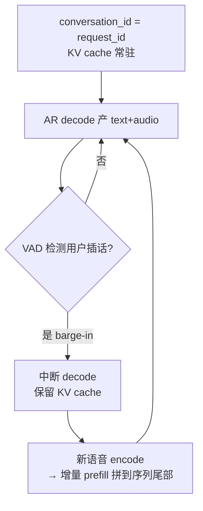
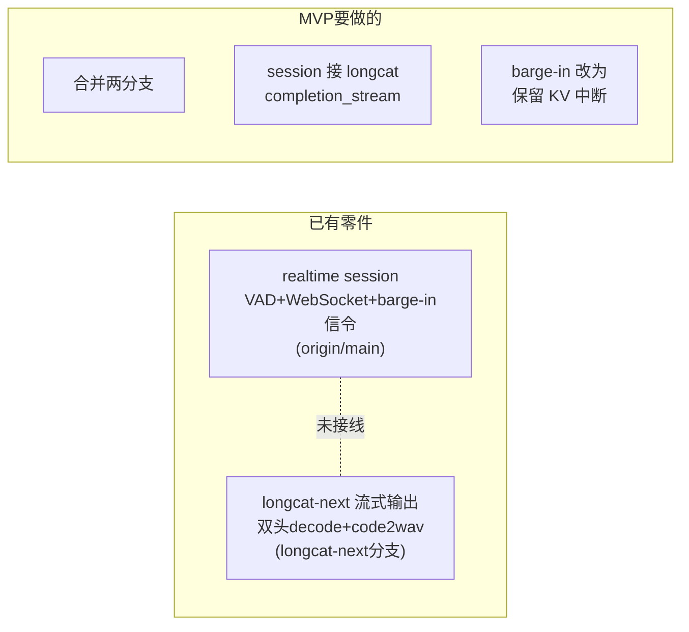

# LongCat-Next Phase 4 设计文档

> **范围**：本文档规划 Phase 4 的三条演进方向 —— (1) 多模态输入缓存 CPU offload、(2) 流式输出性能优化、(3) 全双工对话架构。
>
> **前置**：Phase 1（AR backbone）、Phase 2（多模态输入理解）、Phase 2.5（性能优化）、Phase 3（端到端语音输出）已完成。参见 `README.md` 与 `longcat_next_debug.md`。

---

## 目录

- [1. 多模态输入缓存 CPU Offload](#1-多模态输入缓存-cpu-offload)
- [2. 流式输出性能优化](#2-流式输出性能优化)
- [3. 全双工对话架构](#3-全双工对话架构)
- [4. MVP 工程 Demo 落地方案](#4-mvp-工程-demo-落地方案)
- [5. 落地优先级](#5-落地优先级)

---

## 1. 多模态输入缓存 CPU Offload

### 1.1 现状

图像 / 音频 encoder 的输出缓存目前**常驻 encoder GPU 显存**。

```python
# stages.py — create_image_encoder_executor / create_audio_encoder_executor
cache = StageOutputCache(
    max_size=_ENCODER_CACHE_MAX_SIZE,     # 256 条
    max_bytes=_ENCODER_CACHE_MAX_BYTES,   # 1 GiB
    cache_device=None,                    # ← None = 张量保留在原设备(GPU)
)
```

`StageOutputCache._detach_value` 在 `cache_device=None` 时不做设备迁移，因此缓存的 `visual_embeds` / `audio_embeds`（AR hidden-size 大张量）直接占用 GPU0 / GPU1 的显存，与 ViT / audio tokenizer 的 batch 空间争抢。

### 1.2 目标

将 encoder 输出缓存 offload 到 CPU（pinned memory），释放 encoder GPU 显存，命中时异步搬回 GPU。

### 1.3 可行性

`StageOutputCache` **已原生支持** offload —— `put()` 时 `_detach_value(data, device=self.cache_device)` 会把张量搬到指定设备（`stage_cache.py:82`）。只需将 `cache_device` 从 `None` 改为 `"cpu"`，改动量极小。

### 1.4 Trade-off

| 方案 | GPU 显存 | 命中延迟 | 适用场景 |
|---|---|---|---|
| GPU cache（现状） | 占 encoder GPU 1 GiB | 零拷贝，命中即用 | 显存宽裕、追求极致延迟 |
| CPU offload | 释放 GPU 显存 | 命中多一次 H2D 拷贝 | 显存吃紧（68B MoE + KV cache 争抢） |

**判断**：在 LongCat-Next 场景下 offload 偏合理：
1. Encoder GPU 上也要跑 ViT / audio tokenizer，1 GiB cache 挤占的是 encoder 自己的 batch 空间。
2. Cache 命中的是输入侧（图片/音频文件），命中后本来就要走 relay 到 text_ar，多一次 H2D 相对占比不大。
3. Cache 张量最终归宿本就要经过 CPU relay（TensorRef/SHM），放 CPU 与下游数据流更顺。

### 1.5 实现要点

1. **环境变量门控**，默认关闭以保持向后兼容：
   ```
   SGLANG_OMNI_LONGCAT_ENCODER_CACHE_DEVICE=cpu   # 默认 "gpu"/None
   ```
2. **Pinned memory + 异步 H2D**：offload 后命中路径的同步 H2D 会抵消收益。应给 `StageOutputCache` 增加：
   - `put()` 时把张量搬到 pinned CPU memory（`.pin_memory()`）
   - `get()` 后由 encoder 侧用 `non_blocking=True` 异步搬回 GPU，与后续计算 overlap
3. **不破坏 cache key 语义**：命中判定（`path+size+mtime_ns` 指纹）与设备无关，offload 不影响正确性。

### 1.6 验证方法

`SGLANG_OMNI_LONGCAT_DEBUG_TIMING=1` 下，对比 offload 前后：
- `encoder_cache action=hit` → `image_encoder_h2d` / `audio_encoder_h2d` 的耗时增量（量化 H2D 代价）
- encoder GPU 的 `nvidia-smi` 显存占用下降幅度
- 端到端 P50/P99 首字延迟是否回退

### 1.7 涉及文件

| 文件 | 改动 |
|---|---|
| `scheduling/stage_cache.py` | 增加 pinned memory staging + 异步搬回 |
| `models/longcat_next/stages.py` | `cache_device` 由环境变量解析 |

---

## 2. 流式输出性能优化

### 2.1 当前流式路径

```
text_ar decode(每步 8 codes)
  → _audio_stream_builder 每步发 OutgoingMessage(stream)
  → relay 跨进程 GPU5 → GPU6
  → _StreamingCode2WavScheduler._buffers 攒帧(每 20 帧)
  → flow matching de-tokenizer → HiFi-GAN vocoder
  → PCM bytes(24kHz)
```

### 2.2 已识别瓶颈与优化

#### P1. Vocoder D2H 阻塞（收益最大，有现成参考）

**问题**：`code2wav.py:166` 的 `wav.cpu()` 是阻塞 D2H，卡住下一个 buffer 的 vocoder launch。

**优化**：借鉴 `origin/main` commit `b79b1e0`（"Overlap Code2Wav output materialization with vocoder launches"）—— 把 PCM 的 D2H materialization 与下一次 vocoder launch overlap，用独立 CUDA stream + event 同步。

#### P2. 逐帧跨进程 relay 开销

**问题**：`_audio_stream_builder`（`stages.py:686`）每个 decode step 发一个 `OutgoingMessage`，每帧仅 8 个 int64，帧太小、次数太多，序列化开销占比高。

**优化**：在 text_ar 侧先攒 N 帧再发（streaming chunk coalescing），参考 `origin/main` commit `efad721`（Moss streaming chunk coalescing）。

#### P3. 固定窗口 `_STREAM_FRAMES=20` 首包延迟高

**问题**：`stages.py:805` 硬编码 20 帧才出第一个 PCM chunk，首字延迟（TTFA）与吞吐矛盾。

**优化**：**渐进式窗口** —— 首 chunk 用小窗口（如 5 帧）抢首包延迟，后续逐步放大到 20/40 帧提吞吐。窗口大小由环境变量可调。

#### P4. Vocoder 未做 CUDA Graph capture

**问题**：flow matching + HiFi-GAN 是固定 shape 的小 batch，目前每帧窗口都是 eager launch。

**优化**：对固定窗口的 vocoder forward 做 CUDA Graph capture。参考仓库根目录《再探 CUDA Graph：核心机制、多图复用以及 Dual AR 模型的统一覆盖优化》，多图复用思路适用于不同窗口大小。

#### P5. audio_head 8 步串行 argmax

**问题**：`audio_head.py:345-350` 每个 decode step 内部串行跑 8 次 codebook forward，占 decode 主循环开销。

**优化**：把 8 个 codebook 的 causal depth transformer forward 用一张 CUDA Graph 固定。

### 2.3 优先级

```
P1 vocoder overlap（收益最大、有现成参考）
  > P2 relay coalescing
  > P3 渐进窗口（改首包延迟）
  > P4/P5 CUDA Graph
```

### 2.4 涉及文件

| 文件 | 对应优化 |
|---|---|
| `models/longcat_next/components/code2wav.py` | P1 D2H overlap、P4 vocoder CUDA Graph |
| `models/longcat_next/stages.py` | P2 coalescing、P3 渐进窗口 |
| `models/longcat_next/components/audio_head.py` | P5 audio_head CUDA Graph |

---

## 3. 全双工对话架构

### 3.1 目标

同一对话用一个 request id 维护一致性；生成过程中用户语音可**打断 AR decode**，新输入 token 拼接到**同一 request** 做**增量 prefill**，实现"边听边说"。

### 3.2 与现有能力的关系

| 层 | 现状 | 全双工需要 |
|---|---|---|
| **VAD 半双工**（`origin/main serve/realtime`）| turn-level VAD + barge-in（cancel 整个 response 重来）| barge-in 改为"保留 KV cache 的中断" |
| **流式输出**（Phase 3）| token-level 增量解码，边 decode 边推 PCM | 复用，作为"说"的生产者 |
| **chunked prefill**（Phase 2）| `_longcat_mm_consumed` 跨 chunk 消费 encoder 输出 | 延伸为"decode 中途插入增量 prefill" |

> 注意：VAD 半双工是"回合制对话调度"，流式输出是"回合内增量解码"，两者是编排层与生成层关系，全双工是要在 decode step 粒度真正并行"听"与"说"。

### 3.3 请求生命周期（务实版：中断-续接）



### 3.4 关键改造点

1. **KV cache 生命周期（最大工程量）**
   - 现状：`OmniScheduler` 走 SGLang 标准 "req 完成即回收 token_to_kv_pool"。
   - 需要：单 request 在 decode ↔ prefill 之间反复横跳、KV 常驻。要改 scheduler 的 request 状态机，不只是 model_runner 层。

2. **打断的插入点 vs 打断粒度（两个不同维度）**

   **(a) 插入点 —— 打断逻辑加在哪里？**
   打断永远是 **step 之间的调度决策**，不可能中断正在 GPU 上执行的 forward（CUDA kernel 已 launch）。插入点就在 scheduler event loop 里，一个 batch step 跑完的后处理阶段：
   ```
   run_batch(batch)              # forward + sample（对应 sglang run_one_batch）
     → process_batch_result(...)
       → model_runner.post_decode(...)   # ← 打断信号在这里检查与响应
   ```
   LongCat-Next 的 audio 状态机已经挂在 `LongcatNextModelRunner.post_decode`（`model_runner.py:184`），打断响应天然叠加在同一位置。

   **(b) 粒度 —— 检测到插话后，当前正在说的这段语音切多干净？**

   | 粒度 | 切换时机 | 体验 | 实现 |
   |---|---|---|---|
   | **hard** | 下一个 step 边界立即停 | 最灵敏，可能切到半个音节 | `post_decode` 检测到信号 → 标记中断 + truncate 已发 PCM |
   | **soft** | 当前 stream chunk（如 20 帧）发完再停 | 不切碎音节 | 攒够一个 code2wav 窗口边界再响应 |
   | **semantic** | 当前词/句语义边界再停 | 最自然 | 需额外边界检测 |

   已 stream 但未播放的 PCM 是否 truncate —— 可复用 `origin/main` 的 `ConversationItemTruncate`。

   **(c) async decode 的延迟量化（重要坑）**
   `enable_async_decode=True`（`stages.py:719`）走 one-step lookahead（`_event_loop_async_decode`），进入 `post_decode` 时**下一步已经 launch**。因此 hard barge-in 的**最小打断延迟 ≈ 1-2 个 decode step，而非 0**。MVP 阶段可先关掉 async decode 简化，或接受这 1-2 step 延迟。

3. **RoPE / position 连续性**
   - 增量 prefill 拼到序列尾部时，`position_ids` 要接续；`sglang_model._build_longcat_input_embeds` 的 `replace_positions` 注入需支持"decode 中途插入的新 encoder 输出"，而非仅初始 prefill。

4. **两种全双工形态**
   - **中断-续接（本文档推荐的第一步）**：sequential interleaving，改造量小，可基于现有 chunked prefill 增量演进。
   - **论文 parallel generation（激进）**：同一 decode step 同时产 text+audio、同时消费输入音频（DiNA pure audio modality），改造量大。

5. **复用 realtime 编排层**
   - `origin/main serve/realtime/session.py` 已有 VAD + WebSocket + barge-in 信令，无需重造。
   - 只需：把 `client.completion_stream` 换成长驻 full-duplex request 接口；把 VAD `speech_started` 从"cancel 整个 response"改为"向常驻 request 注入增量 prefill 中断信号"。

### 3.5 落地路线

```
Step 1: 单 request 常驻 KV cache（改 scheduler request 状态机）
Step 2: decode 中途可接受增量 prefill（复用 chunked prefill + _longcat_mm_consumed）
Step 3: barge-in 从 "cancel 重来" 改为 "保留 KV 中断"（改 realtime session）
Step 4: RoPE/position 连续性 + PCM truncate 对齐
Step 5:（可选，激进）走论文 parallel generation 真并行
```

### 3.6 涉及文件

| 文件 | 改动 |
|---|---|
| `scheduling/omni_scheduler.py` | request 状态机 / KV cache 常驻 |
| `models/longcat_next/model_runner.py` | decode 中途增量 prefill 注入 |
| `models/longcat_next/sglang_model.py` | position 连续性、中途 encoder 注入 |
| `serve/realtime/session.py` | barge-in 改为保留 KV 中断、长驻 request 接口 |

---

## 4. MVP 工程 Demo 落地方案

### 4.1 定位

MVP **不追求真全双工**（同一 decode step 并行听+说，工程量大、风险高）。目标是用最小改动跑通一个可演示的闭环：**"可打断的半双工 + 单会话续接"**，验证核心假设。

关键洞察：**大部分零件已存在，MVP 本质是"接线 + 一个保留 KV 的打断"**，而非从零造全双工。



### 4.2 分级实施

#### Level 0 — 接线 Demo（最小，约 1-2 天）

**目标**：realtime WebSocket 前端能和 LongCat-Next 语音对话，支持 VAD 轮次 + "cancel 重来"式打断。

- 合并 `longcat-next` 分支与 `origin/main` 的 `serve/realtime/`
- `RealtimeSessionManager` 传入 LongCat-Next client，`supports_audio_output=True`
- `session.run_response` 的 `client.completion_stream` 直接消费 Phase 3 流式 PCM

**几乎不改模型代码**，产出一个能语音对话、能被 VAD 打断（cancel 式）的 demo。演示已够用。

#### Level 1 — 保留 KV 的打断（核心增量，约 3-5 天）

**目标**：打断时不 cancel 整个 request，而是保留 KV cache、续接新输入。落在 §3.4 已确认的 `post_decode` 插入点：

1. **信号**：VAD `speech_started` → admin message 标记目标 req
2. **step 边界响应**：`LongcatNextModelRunner.post_decode` 检测标记 → audio 状态机切回 text + 保留 KV（不 finished、不 release pool）
3. **续接**：新语音 encode → 增量 prefill 拼到同一 req 序列尾（复用 `_longcat_mm_consumed` 的 chunked prefill 能力）
4. **PCM truncate**：复用 `ConversationItemTruncate` 丢弃未播音频

这是 MVP 的**技术含金量**所在——证明"单 id 续接 + 保留 KV 打断"可行。

#### Level 2 — 接近全双工（进阶，2 周+，不放进 MVP）

边听边说、interleaved prefill/decode（§3.4 第 4 点的 parallel generation）。留作后续里程碑。

### 4.3 MVP 风险与应对

| 风险 | 说明 | MVP 应对 |
|---|---|---|
| **KV cache 生命周期** | SGLang 标准 req 完成即回收 pool，常驻要改 scheduler 状态机 | Level 1 只做"单会话单 req 常驻"，不做并发多会话，规避复杂度 |
| **async decode 打断延迟** | 已 launch 下一步，最小打断延迟 ≈ 1-2 step（见 §3.4.2c） | Demo 可先关 async decode 简化，或接受 1-2 step 延迟 |

### 4.4 建议

做 **Level 0 + Level 1** 作为 MVP：Level 0 保证有可跑可演示的兜底，Level 1 是核心价值点且恰好落在已理解的 `post_decode` 插入点上；Level 2 真并行风险高，MVP 阶段不碰。

---

## 5. 落地优先级

| 方向 | 工程量 | 风险 | 建议顺序 |
|---|---|---|---|
| 流式输出优化 P1（vocoder overlap） | 小 | 低（有参考） | **先做** |
| Encoder cache CPU offload | 小 | 低 | 与 P1 并行 |
| **MVP Level 0（接线 Demo）** | 小 | 低 | **可独立并行，快速出可演示成果** |
| 流式输出优化 P2/P3 | 中 | 低 | 次之 |
| **MVP Level 1（保留 KV 打断）** | 中 | 中 | 依赖 Level 0，MVP 核心价值 |
| 全双工 Step 1-2（KV 常驻 + 增量 prefill） | 大 | 中 | 独立里程碑（Level 1 是其单会话子集） |
| 全双工 Step 3-4（barge-in + 对齐） | 中 | 中 | 依赖 Step 1-2 |
| 流式 P4/P5（CUDA Graph）、全双工 Step 5 / MVP Level 2 | 大 | 高 | 最后 |
