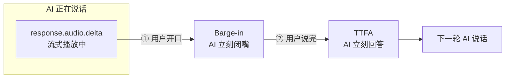
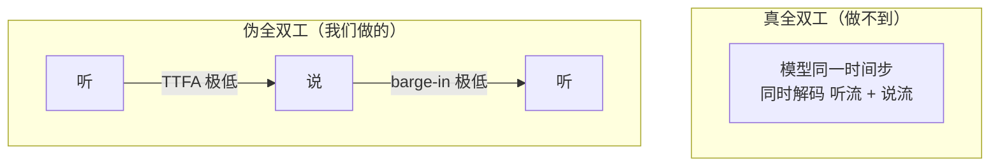
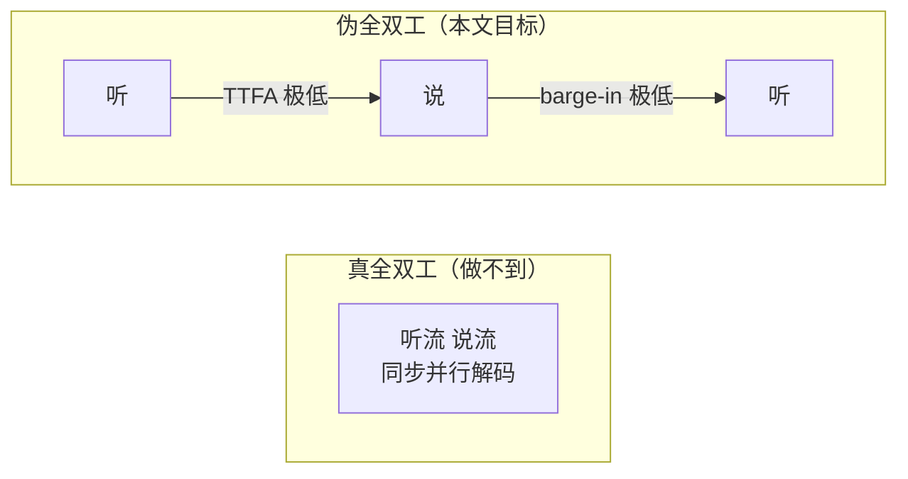
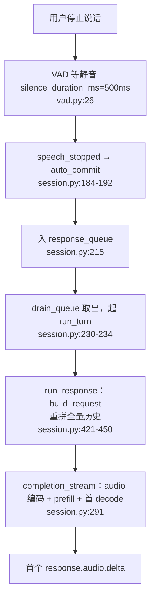
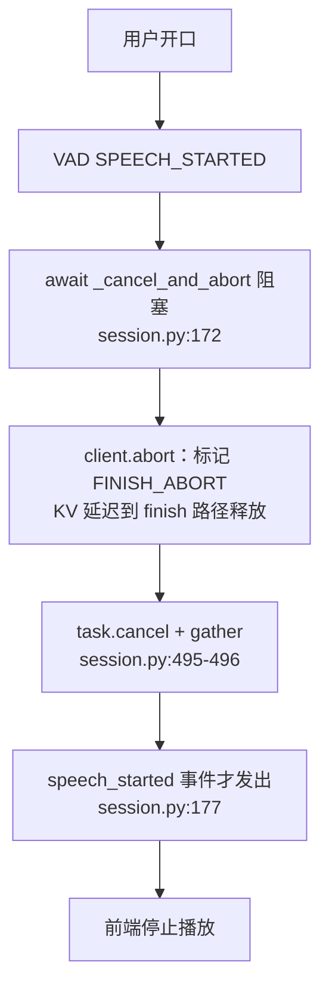
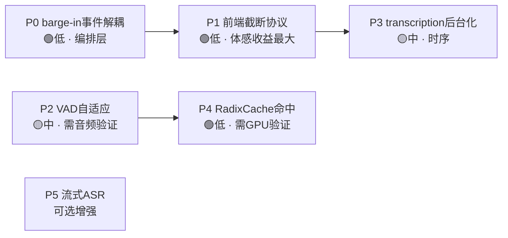

# LongCat-Next Phase 5 设计文档 — 伪全双工延迟优化

> **范围**：在已落地的 Level 0（可打断的半双工语音对话）之上，通过**极致压低两类延迟**，让用户体感逼近真全双工（"边说边听、随说随断"），但不改变模型 turn-based 本质、不训练模型。
>
> **前置结论（见 Phase 4 §3、§4）**：LongCat-Next 是 turn-based 模型，其输出状态机（`state_machine.py`：INIT→GEN_TEXT/IMAGE/AUDIO→NEXT_AUDIO→ABORT）**无"听"状态**，架构层不支持真双流并行解码。官方 Omni-Flow（模型作者）亦只做到 cancel 式 barge-in。真全双工需换模型（如 Moshi）或重训，不在本文范围。
>
> **本文目标**：把"伪全双工"做到业界产品级体感。

---

## 目录

- [0. 一图看懂：伪全双工是如何做到的](#0-一图看懂伪全双工是如何做到的)
- [1. 问题定义：什么是"伪全双工体感"](#1-问题定义什么是伪全双工体感)
- [2. 延迟拆解：当前 Level 0 的延迟来源](#2-延迟拆解当前-level-0-的延迟来源)
- [3. 优化项设计](#3-优化项设计)
- [4. 延迟预算目标](#4-延迟预算目标)
- [5. 落地路线与优先级](#5-落地路线与优先级)
- [6. 验证方法](#6-验证方法)
- [7. 涉及文件](#7-涉及文件)
- [8. 实现状态（P0–P5 全部落地）](#8-实现状态p0p5-全部落地)

---

## 0. 一图看懂：伪全双工是如何做到的

**一句话**：伪全双工的核心不是"真的同时听和说"（那需要换模型），而是**用极低延迟的快速轮转，让用户感知不到"轮次边界"**。工程本质 = 压缩两个延迟指标（TTFA + Barge-in）+ 保证 VAD 端点准确。



伪全双工的体感由**两个关键时刻**决定：

| 时刻 | 指标 | 用户主观感受 | 优化项 |
|---|---|---|---|
| **① 用户插话** | Barge-in 延迟 | "我一开口它马上闭嘴" | P0 + P1 |
| **② 用户说完** | TTFA | "我一说完它马上答" | P2 + P3 + P4 |

**① 让 AI "开口即停"（Barge-in）**
- **P0**：VAD 触发 `speech_started` 的那一刻，**先发停播信号，再后台清理引擎**（原来要等引擎 abort 完成才通知前端，白等一个往返）。
- **P1**：光服务端停了不够，**前端播放缓冲里还有已下发的音频在响**——前端收到信号立即 `flushPlayback()` 清空所有已排程音频块，声音当场消失。
- 合起来把打断延迟从"一个 abort 往返 + 前端 buffer"压到"几十毫秒的前端 flush"。**这是体感提升最大的一环。**

**② 让 AI "话音即答"（TTFA）**
- **P2**：VAD 判断"你说完了"的静音等待从 500ms → 300ms，并自适应。直接省 ~200ms。
- **P3**：原来一轮要跑完"回答 + 转写"两趟才轮到下一轮，转写在拖慢下一轮；现在转写移到后台，回答一结束就能立刻接下一轮。
- **P4**：每轮不再从头重算历史——保证请求前缀逐字稳定，让 RadixCache 命中，prefill 只付增量。

**为什么叫"伪"而不是"真"**



- **真全双工**（如 Moshi）：模型架构层支持双流并行，AI 说话的同时真的在听你。LongCat-Next 是 turn-based 模型（状态机里根本没有"听"状态），架构上做不到。
- **伪全双工**（我们）：还是一次只做一件事，但每次切换快到你察觉不出边界，体感上就像它一直在听、随时能被打断、答得飞快。

---

## 1. 问题定义：什么是"伪全双工体感"

真全双工 = 模型在同一时间步同时解码"听流"和"说流"。我们做不到。
**伪全双工** = 用**极低延迟的快速轮转**，让用户感知不到"轮次边界"：

| 用户主观体验 | 背后的客观指标 | 目标 |
|---|---|---|
| "我一说完它马上就答" | **TTFA**（Time To First Audio）：用户停止说话 → 首个音频字节 | 越低越好 |
| "我一开口它立刻闭嘴" | **Barge-in 延迟**：用户开口 → 模型音频停止 | 越低越好 |
| "它答的时候我插话它能懂" | **打断后上下文保真**：打断点之前说的内容不丢 | 不丢 |
| "不会把我的话切一半" | **VAD 端点准确率**：不误切、不漏切 | 稳 |

> 核心洞察：伪全双工的工程本质是**两个延迟指标（TTFA + Barge-in）的极致压缩** + **端点检测（VAD）的准确性**。不是造并行，而是把轮转做到"无感"。



---

## 2. 延迟拆解：当前 Level 0 的延迟来源

以下均为**实读代码确认**的瓶颈点（非推测），标注文件行号。

### 2.1 TTFA 链路（用户停止说话 → 首个音频字节）



| # | 延迟源 | 代码位置 | 量级 | 可优化性 |
|---|---|---|---|---|
| T1 | **VAD 静音等待 500ms** | `vad.py:26` `silence_duration_ms=500` | ~500ms | 🟢 高（可调低 + 自适应） |
| T2 | 队列串行：上一轮 `run_turn` 未完则排队 | `session.py:230-234` | 取决于上一轮 | 🟡 中 |
| T3 | 每轮重拼全量历史 → prefill | `session.py:435-450` | 随轮次增长 | 🟢 高（RadixCache 前缀命中，见 Phase4 §3.4） |
| T4 | 音频 encoder 前向 | `completion_stream` 内 | 固定 | 🟡 中（encoder cache 已做） |
| T5 | prefill + 首 token decode | 引擎内 | 固定 | 🔴 低（模型固有） |

### 2.2 Barge-in 链路（用户开口 → 模型音频停止）



| # | 延迟源 | 代码位置 | 量级 | 可优化性 |
|---|---|---|---|---|
| B1 | **abort 是异步善后**：running req 只标记 `FINISH_ABORT`，KV 在 finish 路径释放；若 async decode 已 launch 下一步，最小打断延迟 ≈ 1–2 decode step | Phase4 §3.4.3c | 1–2 step | 🟡 中 |
| B2 | **barge-in 阻塞在 `speech_started` 之前**：`await _cancel_and_abort` 完成后才发 `speech_started` | `session.py:172` vs `177` | 一次 abort RTT | 🟢 高（可并发/提前发事件） |
| B3 | 前端音频缓冲：已下发的 `audio.delta` 仍在客户端 buffer 里播放 | 客户端 | buffer 深度 | 🟢 高（前端 flush + 服务端截断信号） |
| B4 | VAD `SPEECH_STARTED` 本身要攒够帧才触发 | `vad.py:57-87` | ~1 帧 32ms + 阈值 | 🟡 中 |

### 2.3 其他影响体感的点

| # | 问题 | 代码位置 | 影响 |
|---|---|---|---|
| X1 | **response 与 transcription 串行** | `session.py:249-250` | transcription 占用 GPU，拖慢/阻塞下一轮 TTFA |
| X2 | **音频被编码两次**（response pass + transcription pass 各传一次 `audios`） | `session.py:291,383` | 双倍 encoder 开销 |
| X3 | drain_queue 等**整个 run_turn（含 transcription）**结束才起下一轮 | `session.py:234` | 下一轮 TTFA 被 transcription 拖累 |

---

## 3. 优化项设计

按"投入产出比"排序，每项给出**改动点、预期收益、风险**。

### P0 — Barge-in 事件与 abort 解耦（先发事件，后台 abort）

**问题**：`session.py:172` 先 `await _cancel_and_abort`（含一次引擎 abort RTT + task cancel + gather），完成后才在 `:177` 发 `speech_started`。用户开口到"模型闭嘴信号"多等了一个 abort 往返。

**设计**：把"通知前端停播"与"后台清理引擎"解耦——
1. VAD `SPEECH_STARTED` 一触发，**立即**先发 `speech_started`（可附带一个明确的"停止播放"语义，如约定客户端收到 `speech_started` 即 flush 播放缓冲）。
2. `_cancel_and_abort` 改为**后台任务**（`asyncio.create_task`）异步执行，不阻塞事件发送。
3. 保证 abort 完成前不会启动新一轮（drain_queue 层做 barrier）。

```python
# session.py handle_vad_emit / SPEECH_STARTED（设计示意）
if emit.event_type == VADEvent.SPEECH_STARTED:
    # 1) 立刻通知前端停播（不等引擎）
    await self.send(make_event("input_audio_buffer.speech_started", ...))
    # 2) 后台清理在途 response（不阻塞）
    prev_task, prev_rid = self.active_task, self.active_request_id
    self._pending_abort = asyncio.create_task(
        self._cancel_and_abort(prev_task, prev_rid)
    )
```

- **收益**：Barge-in 感知延迟 ↓ 一个 abort RTT（B2）。
- **风险**：需保证下一轮 `run_turn` 在 `_pending_abort` 完成后才启动（否则新旧 req 抢 KV）。drain_queue 里 `await self._pending_abort` 做栅栏。
- **风险等级**：🟢 低（纯编排层，离线可验证）。

### P1 — 前端播放缓冲截断协议

**问题**：即便服务端停了，已下发的 `audio.delta` 仍在客户端缓冲区继续播（B3）。用户听到"开口后模型还响了半秒"。

**设计**：约定一个截断语义——
- 服务端在 barge-in 时发送一个显式事件（复用 `speech_started` 或新增 `response.audio.flush`），客户端收到后**立即清空音频播放队列**（AudioContext / MediaSource buffer flush）。
- 服务端后续不再发该 `response_id` 的任何 `audio.delta`（P0 的 abort 保证）。

- **收益**：Barge-in **体感**延迟 ↓ 到接近前端 flush 时间（几十 ms）。这是**体感收益最大**的一项。
- **风险**：需要前端配合（WebUI 客户端改动）。协议要向后兼容（老客户端忽略新事件）。
- **风险等级**：🟢 低（协议 + 前端）。

### P2 — VAD 端点延迟自适应（silence_duration 动态化）

**问题**：`vad.py:26` 固定 `silence_duration_ms=500`。每轮结束都要等 500ms 静音才提交（T1），这是 TTFA 的最大单一固定成本。

**设计**：
1. **降低默认值**：500ms → 可配置，实测在安静环境下 200–300ms 已足够（silero-vad 端点较准）。
2. **自适应**：根据近期误切率动态调整——若频繁在句中误触发 `speech_stopped`（用户抱怨被打断），自动上调；反之下调。
3. **保留 `prefix_padding_ms`**（当前 300ms）保证不吃掉句首。

- **收益**：TTFA ↓ 200–300ms（T1），**最直接的 TTFA 收益**。
- **风险**：调太低会把"说话中的停顿"误判为结束，切碎句子。需要配合 VAD 阈值调优 + 实测。
- **风险等级**：🟡 中（影响 VAD 准确率，需真实音频验证）。

### P3 — response / transcription 并行化 + 去重编码

**问题**：
- `session.py:249-250`：response 完成后才跑 transcription，串行。
- drain_queue（`:234`）等整个 run_turn（含 transcription）才起下一轮 → 下一轮 TTFA 被 transcription 拖累（X3）。
- 音频编码两次（X2）。

**设计**：
1. **transcription 移出 TTFA 关键路径**：response 一结束就允许 drain_queue 进入下一轮；transcription 作为**低优先级后台任务**跑（它只用于填历史/UI，不阻塞对话）。
2. **并行**：response 与 transcription 用两个并发 `completion_stream`（若引擎并发允许），或 transcription 完全后台化。
3. **编码去重**（可选，需引擎支持）：同一段音频的 encoder 输出在两个 pass 间复用（encoder cache 已有基础，见 Phase4 §1）。

```python
# run_turn（设计示意）
async def run_turn(self, item_id, audio_payload):
    response_text = await self.run_response(audio_payload)   # 关键路径
    # transcription 后台化，不阻塞下一轮
    asyncio.create_task(self._background_transcribe(item_id, audio_payload, response_text))
```

- **收益**：下一轮 TTFA 不再被 transcription 拖累（X3）；GPU 利用更合理（X1）。
- **风险**：transcription 后台化后，历史写入时序要用 finally/回调保证（沿用现有 P1 修复的 try/finally 思路）；后台任务生命周期需随 session teardown 清理。
- **风险等级**：🟡 中（并发时序 + 历史一致性）。

### P4 — 多轮 KV 前缀复用确定性（RadixCache 命中保证）

**问题**：每轮重拼全量历史 prefill（T3），随轮次线性增长。Phase4 §3.4 已确认可靠 RadixCache 前缀复用，但**前提是请求前缀逐字一致**。

**设计**：
1. 保证同会话 `build_response_request` 的 **system prompt + 历史拼接完全确定**（无时间戳/随机 id 混入前缀）。
2. 校验 RadixCache 实际命中率（GPU 阶段用引擎指标观测）。
3. 历史增长时前缀单调延长，命中率应稳定高。

- **收益**：TTFA 中的 prefill 部分随轮次基本恒定（只算增量），长对话尤其明显（T3）。
- **风险**：前缀一旦有一字节差异，命中失效 → 全量重算。需严格确定性。
- **风险等级**：🟢 低（配置/确定性），但**需 GPU 验证命中率**。

### P5 —（可选）流式 ASR 边听边转写

**问题**：当前 transcription 是"整段说完后再转"。若要在 UI 上实时显示用户说的话（更像全双工），需要边听边转。

**设计**：接入流式 ASR（chunk 级），`input_audio_buffer.append` 时增量转写并发 `transcription.delta`。**与主对话解耦**，纯 UI 增强。

- **收益**：UI 体感提升（用户看到自己的话实时上屏）。
- **风险**：额外 ASR 算力；与 VAD/主链路的协调。
- **风险等级**：🟡 中（独立增强，非核心路径）。

---

## 4. 延迟预算目标

| 指标 | 当前（估算） | 优化后目标 | 主要贡献项 |
|---|---|---|---|
| **TTFA**（停说→首音频） | ~500ms(VAD) + prefill + 首decode | VAD 200–300ms + 增量prefill + 首decode | P2 + P4 |
| **Barge-in 感知延迟**（开口→停播） | 1 abort RTT + 前端buffer | 前端 flush（几十 ms） | P0 + P1 |
| **下一轮 TTFA 不被 transcription 拖累** | 被拖累 | 不被拖累 | P3 |

> 说明：prefill / decode 的绝对值是**模型固有**，需 GPU 实测。本文优化的是**可控的编排层延迟**（VAD 等待、abort RTT、前端 buffer、串行阻塞、重复 prefill）。

---

## 5. 落地路线与优先级



| 优先级 | 项 | 工程量 | 风险 | 依赖 | 建议 |
|---|---|---|---|---|---|
| **1** | P0 barge-in 事件与 abort 解耦 | 小 | 🟢低 | 无 | **先做**，纯编排层离线可验证 |
| **2** | P1 前端播放截断协议 | 小 | 🟢低 | P0 | **体感收益最大**，配合前端 |
| 3 | P3 transcription 后台化 + 去重 | 中 | 🟡中 | 无 | 解开下一轮 TTFA 拖累 |
| 4 | P2 VAD 端点自适应 | 小 | 🟡中 | 无 | 需真实音频调参，避免切碎 |
| 5 | P4 RadixCache 前缀命中确定性 | 小 | 🟢低 | GPU | 长对话收益，需命中率实测 |
| 6 | P5 流式 ASR（可选） | 中 | 🟡中 | 无 | UI 增强，非核心 |

> **建议先做 P0 + P1**：两者纯编排层 + 前端协议，无需 GPU，能立刻拿到"开口即停"的最强体感提升；再做 P3 解开串行；P2/P4 需实测环境。

---

## 6. 验证方法

| 项 | 离线可验证 | 需 GPU/真实音频 |
|---|---|---|
| P0 事件解耦 | ✅ 单测：mock client.abort，断言 `speech_started` 先于 abort 完成发出 | — |
| P1 截断协议 | ✅ 协议单测 + 前端手测 | — |
| P3 后台化 | ✅ 单测：断言 run_response 返回后 drain_queue 可进入下一轮；历史最终一致 | 并发压测 |
| P2 VAD 自适应 | 部分（逻辑单测） | ✅ 真实语音误切率/漏切率 |
| P4 RadixCache | — | ✅ 引擎命中率指标 + TTFA 随轮次曲线 |

**关键指标采集**：在 session 层加 env-gated timing 打点（沿用 Phase 2.5 debug timing 风格），记录：
- `t_speech_stopped → t_first_audio_delta`（TTFA）
- `t_speech_started → t_last_audio_delta_sent`（服务端 barge-in 停播）
- 每轮 prefill token 数（观测 RadixCache 增量）

---

## 7. 涉及文件

| 文件 | 改动 | 对应优化项 |
|---|---|---|
| `serve/realtime/session.py` | barge-in 先发事件后台 abort；transcription 后台化；timing 打点 | P0, P3 |
| `serve/realtime/vad.py` | `silence_duration_ms` 可配 + 自适应逻辑 | P2 |
| `serve/realtime/events.py` | 新增/约定音频截断事件语义 | P1 |
| `deploy/webui`（或对应前端客户端） | 收到截断事件 flush 播放缓冲 | P1 |
| `serve/realtime/manager.py` | 流式 ASR 接入（可选） | P5 |
| `build_response_request` | 前缀拼接确定性校验 | P4 |

---

## 附：与 Phase 4 的关系

- Phase 4 §3/§4 定义了全双工的 A/B/C/D 分级，落地了 **Level 0（A+B）= 可打断半双工**。
- 本 Phase 5 文档是对 **Level 0 的延迟极致优化**，把"可打断"打磨成"伪全双工体感"。
- 不涉及 Phase 4 的 Level 2（D，真 mid-stream 并行）——那需换模型/重训，独立里程碑。

---

## 8. 实现状态（P0–P5 全部落地）

> 以下均已编码实现并通过 lint + 语法校验，待 GPU/真实音频端到端验证。

| 项 | 状态 | 落地位置 | 关键点 |
|---|---|---|---|
| **P0** barge-in 事件解耦 | ✅ 已实现 | `session.py::handle_vad_emit`（SPEECH_STARTED 分支）+ `drain_queue` 栅栏 | 先发 `speech_started` + `response.audio.flush`，`_cancel_and_abort` 改后台 `create_task`；`drain_queue` 起下一轮前 `await self._pending_abort` |
| **P1** 前端播放截断 | ✅ 已实现 | 服务端 `session.py` 发 `response.audio.flush`；前端 `playground/qwen-omni/realtime/app.js` | 前端新增 24kHz PCM 调度播放（`enqueueAudioChunk`）+ `flushPlayback()`，收到 `speech_started`/`response.audio.flush` 立即停播并清空 `scheduledSources` |
| **P2** VAD 自适应端点 | ✅ 已实现 | `vad.py::VADConfig` + `StreamingVAD.process` | 默认 `silence_duration_ms` 500→300；新增 `adaptive`/`silence_min_ms`/`silence_max_ms`/`false_cut_window_ms`；快速复说→上调，干净边界→下调；`session.update.turn_detection` 可覆盖 |
| **P3** transcription 后台化 | ✅ 已实现 | `session.py::run_turn` + `_background_transcribe` | response 一结束即放行下一轮；转写走后台 task；预留 `pending` user slot 保证时序，完成时回填 |
| **P4** RadixCache 前缀确定性 | ✅ 已实现 | `session.py::build_response_request` | 固定顺序拼历史 + 跳过 `pending`/空 item，保证前缀逐字稳定 |
| **P5** 流式 ASR（可选） | ✅ 已实现（env-gated） | `session.py::handle_audio_append` + `_maybe_emit_partial_transcript` | `SGLANG_OMNI_REALTIME_STREAMING_ASR=1` 开启；节流 400ms + 单飞，发 `transcription.delta{partial:true}` |
| timing 打点 | ✅ 已实现（env-gated） | `session.py` 顶部 `_log_timing` | `SGLANG_OMNI_REALTIME_TIMING=1` 开启，记录 TTFA / barge-in 信号 |

### 环境变量

| 变量 | 默认 | 作用 |
|---|---|---|
| `SGLANG_OMNI_REALTIME_TIMING` | `0` | 开启延迟打点日志（TTFA、barge-in） |
| `SGLANG_OMNI_REALTIME_STREAMING_ASR` | `0` | 开启 P5 边说边转写（额外 ASR 算力） |

### 待验证（需 GPU / 真实音频）

- P0/P3：并发压测 barge-in 与后台转写的 KV 释放时序、历史一致性。
- P2：真实语音下 300ms 端点的误切/漏切率，自适应收敛行为。
- P4：RadixCache 实际命中率 + TTFA 随轮次曲线。
- 端到端 TTFA / barge-in 感知延迟绝对值（用 timing 打点采集）。
